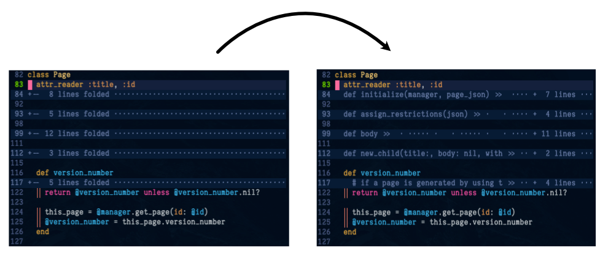

# Better Foldtext

## Overview

Benefits:
- Does not coneal contents of line
- looks good
- no problems with performance

## Usage

(using Plug.vim) add `Plug 'joelstrouts/better-foldtext.vim'` to your vim configuration.
